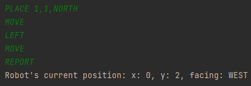
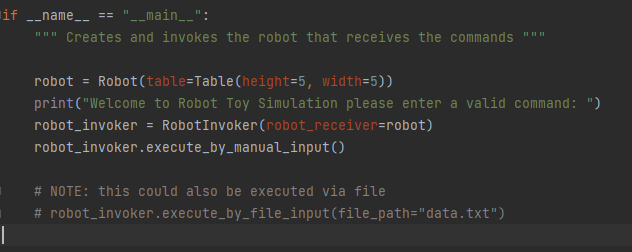

[](https://github.com/psf/black)


## Before you start here's a random joke to annoy you. haha 😂

# Toy Robot Code Challenge
## Description
The application is a simulation of a toy robot moving on a square table top, of dimensions 5 units x 5 units. There are no
other obstructions on the table surface. The robot is free to roam around the surface of the table, but must be prevented
from falling to destruction. Any movement that would result in the robot falling from the table must be prevented,
however further valid movement commands must still be allowed.

See full requirements here: [Requirements](docs/md/problem_requirements.md)
## Getting Started
This project is working and tested only in python 3.10.
### Prerequisites
* python3.10
* python virtualenv
### Installation
This app doesn't rely on any external dependencies or services.
1. Clone the repo
    ```sh
    git clone https://github.com/clarencelayba/iress-code-challenge.git
   ```
2. Activate ```virtualenv ```
    ```sh
   cd toy_robot
   python -m venv venv
   source venv/bin/activate
   ```
3. Install dependencies(if you want to run the pytest)
    ```sh
    pip install -r requirements.txt
    ```
4. Add pre-commit hooks(if you want to contribute to this repo)
see pre-commit-config.yaml file for complete list of hooks
   ```sh
   pre-commit install
   ```
## Usage
### Manual input in the console
#### Running the app:
   ```sh
    python run.py
   ```
#### Allowed Robot commands for simulation:
```
PLACE X,Y,F(NORTH|SOUTH|EAST|WEST)
MOVE
LEFT
RIGHT
REPORT
```

#### Sample commands and output


### Automated input via file
For now you can uncomment the code in the run file that states execution via file, make sure to comment the manual execution. File can be found in the root directory. Update as you please.


#### Running the app(Same as manual):
   ```sh
    python run.py
   ```
